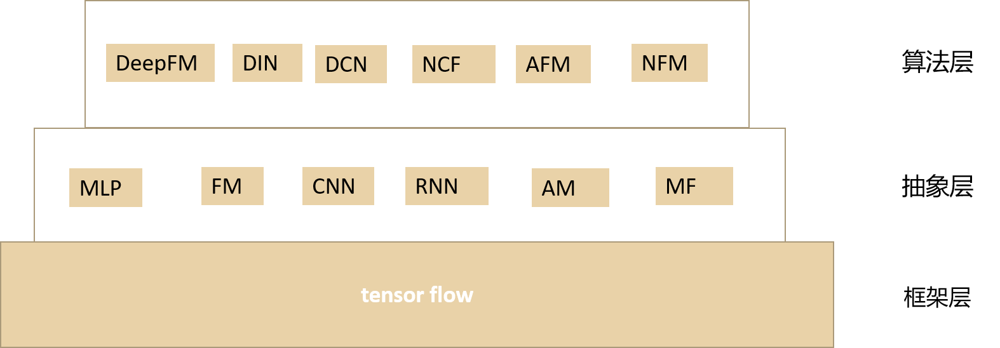

# DeepRS

主要提供一个扩展的、易于使用的深度学习推荐算法库，该库主要提供以下算法deepFM、NFM、AFM、DIN、DCN、DIEN、NCF、CCCFNet、DeepCoNN、ConvMF、RRN。

## 架构设计 ##

**框架层**:

**抽象层**:

**算法层**:

## Release notes ##

|Release | Notes |
|--------|:-----:|
| 0.01     | 实现deepFM算法|

## Dataset ##

## Rreferences ##
[1]	S. Rendle,”Factorization machines,” in Proceedings of IEEE International Conference on Data Mining(ICDM), pp. 995-1000, 2010.

[2]	Heng-Tze Cheng, Levent Koc, Jeremiah Harmsen, et al. Wide & deep learning for recommender systems.In DLRS, 2016.

[3]	Xiangnan He, Lizi Liao, Hanwang Zhang,Liqiang Nie, Xia Hu, and Tat-Seng Chua. Neural collaborative filering. In WWW, 2017

[4]	Yuchin Juan, Yong Zhuang, Wei-Sheng Chin,and Chih-Jen Lin. Field-aware factorization machines for ctr prediction. In RecSys, 2016.

[5]	Steffen Rendle. Factorization machines with libfm.ACM TIST, 2012.

[6]	Xiangnan He and Tat-Seng Chua. Neural factorization machines for sparse predictive analytics. In SIGIR,2017.

[7]	Huifeng Guo, Ruiming Tang, Yunming Ye, Zhenguo Li, and Xiuqiang He. 2017. DeepFM: A Factorization-Machine based Neural Network for CTR Prediction. In IJCAI. 2782–2788.

[8]	Donghyun Kim, Chanyoung Park, Jinoh Oh, Sungyoung Lee, and Hwanjo Yu. 2016. Convolutional matrix factorization for document context-aware recommendation. In Proceedings of the 10th ACM Conference on Recommender Systems. ACM, 233–240.

[9]	Shuai Zhang, Lina Yao, and Aixin Sun. 2017. Deep Learning based Recommender System: A Survey and New Perspectives.ACM J. Comput. Cult. Herit. 1, 1, Article 35 (July 2017), 35 pages.

[10]Jianxun Lian, Fuzheng Zhang, Xing Xie, and Guangzhong Sun. 2017. CCCFNet: A Content-Boosted Collaborative Filtering Neural Network for Cross Domain Recommender Systems. In Proceedings of the 26th International Conference on World Wide Web Companion.International World Wide Web Conferences Steering Committee, 817–818

[11]Chao-Yuan Wu, Amr Ahmed, Alex Beutel, Alexander J Smola, and How Jing. 2017. Recurrent recommender networks. In Proceedings of the Tenth ACM International Conference on Web Search and Data Mining. ACM, 495–503

[12]Lei Zheng, Vahid Noroozi, and Philip S. Yu. 2017. Joint Deep Modeling of Users and Items Using Reviews for Recommendation. In Proceedings of the Tenth ACM International Conference on Web Search and Data Mining (WSDM ’17). ACM, New York, NY, USA, 425–434.https://doi.org/10.1145/3018661.3018665

[13]Ruoxi Wang , Bin Fu , Gang Fu , and Mingliang Wang .Deep & Cross Network for Ad Click Predictions. arXiv:1708.05123v1 [cs.LG] 17 Aug 2017.

[14]Guorui Zhou, Chengru Song, Xiaoqiang Zhu,Xiao Ma, Yanghui Yan, Xingya Dai
Han Zhu, Junqi Jin, Han Li,Kun Gai .Deep Interest Network for Click-Through Rate Prediction. arXiv:1706.06978v2 [stat.ML] 23 Jun 2017.

[15]Weinan Zhang, Tianming Du1 and Jun Wang .Deep Learning over Multi-field Categorical Data– A Case Study on User Response Prediction. arXiv:1601.02376v21 [cs.LG] 11 Jan 2016.

[16]Yanru Qu, Han Cai, Kan Ren, Weinan Zhang, Yong Yu, Ying Wen, and Jun Wang. Productbased neural networks for user response prediction. CoRR,abs/1611.00144, 2016.
